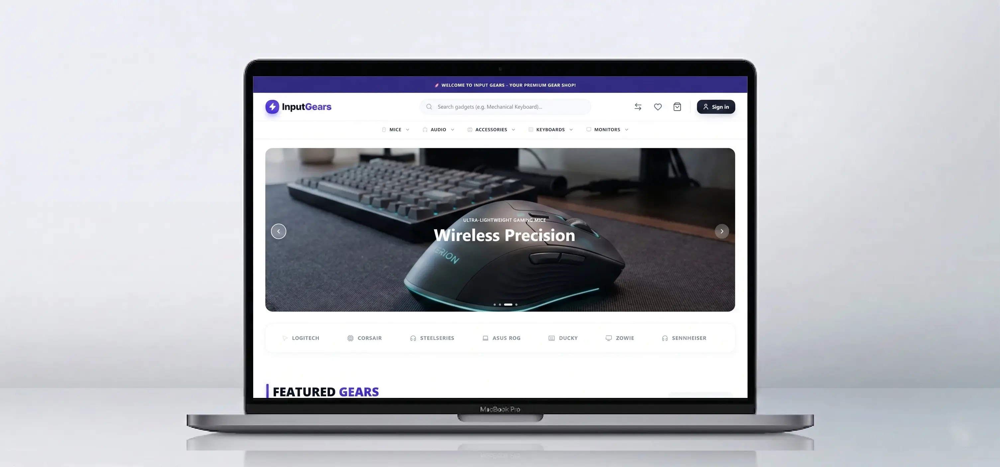

# ⚡ Input Gears — Full-Stack E-Commerce (Next.js + Postgres + Stripe)

[](https://nextjs.org/)
[](https://tailwindcss.com/)
[](https://www.postgresql.org/)
[](https://www.prisma.io/)
[](https://stripe.com/)
[](https://inputgears.vercel.app/)

Production-grade tech-gadget store: server-priced checkout, atomic inventory reservations, idempotent Stripe webhooks, role-based admin suite.

**Live:** [inputgears.vercel.app](https://inputgears.vercel.app/) · **Stack:** Next.js 16 App Router, React 19, Tailwind v4, PostgreSQL + Prisma, Better Auth, Stripe, Zustand, Cloudinary, Upstash Redis, Zod

---

## 📸 Preview

<div align="center">
  
</div>

---

## ✨ What it does

**Storefront**
- Live search (trigram + fallback, debounced, keyboard-navigable) · category / brand / price filters + sort · 4 catalog views
- Product page with variants, real review ratings, related items, share + wishlist + compare
- Guest + persisted cart with server-side stock reservations

**Checkout & orders**
- Single source of truth for money (`computeOrderTotals`) — quote, PaymentIntent, order row and webhook all match
- COD + Stripe, coupon / shipping-zone / tax-aware totals, guest checkout with address-book save
- Guest order tracking (`orderNumber + phone/email`), invoice email (Resend, optional)

**Admin (`/admin` — SUPER_ADMIN / MANAGER / CONTENT_EDITOR)**
- Products, categories, sale manager, coupons, shipping zones, tax rate, hero slides / brand logos / top bar CMS
- Order fulfillment pipeline, stock bulk-update + stock logs, reviews moderation, customers + team roles, audit logs, live revenue chart from real orders

---

## 🧱 Architecture notes (why it's hire-ready)

- `src/modules/checkout/lib/totals.ts` — the only place money is computed
- `src/modules/checkout/lib/create-order.ts` — idempotent on `stripePaymentIntentId`, conditional stock decrement + conditional coupon redeem (no oversell / over-redeem races)
- `src/app/api/stripe/webhook/route.ts` — raw-body signature verify, recovers orphaned payments from intent metadata
- `src/proxy.ts` — webhook bypasses rate-limit, API-only limiting, session check only on `/account,/admin,/sign-in` for fast public TTFB
- `src/lib/ratelimit.ts` — lazy Upstash init (missing env fails at request time, not build time)

---

## 🚀 Quick start (2 min)

Prereqs: Node.js 18+, a PostgreSQL DB, free Stripe / Cloudinary / Upstash accounts.

```bash
git clone https://github.com/justrakibhassan/input-gears.git
cd input-gears
npm install
cp .env.example .env  # fill keys (see below)
npx prisma db push
npx prisma db seed    # demo catalog + hero + 7-day demo orders for the revenue chart
npm run dev           # http://localhost:3000
```

Minimal env — full list with comments in [`.env.example`](./.env.example):

```env
DATABASE_URL=
BETTER_AUTH_SECRET=
NEXT_PUBLIC_BETTER_AUTH_URL=http://localhost:3000
STRIPE_SECRET_KEY= / NEXT_PUBLIC_STRIPE_PUBLISHABLE_KEY= / STRIPE_WEBHOOK_SECRET=
CLOUDINARY_CLOUD_NAME= (+ NEXT_PUBLIC_* variants)
UPSTASH_REDIS_REST_URL= / UPSTASH_REDIS_REST_TOKEN=
```

Local Stripe webhook:

```bash
stripe listen --forward-to localhost:3000/api/stripe/webhook
```

Useful paths: `/products` · `/track-order` · `/admin` (make your user `SUPER_ADMIN` in Prisma Studio first) · `/admin/settings` (coupons / shipping / tax).

> ⚠️ `prisma db seed` wipes demo data (`deleteMany`) — run once per environment, never on a live DB with real orders.

---

## 📄 License

MIT.

## 👨‍💻 Author

Built by [Rakib Hassan](https://rakibhassan.vercel.app) — Full-stack (Next.js / Postgres / Stripe).
